# Medical Appointment Booking System 🏥


> A full-stack medical appointment booking platform built with Django — featuring real-time booking status updates via WebSocket, Celery background tasks, JazzCash payment integration, social authentication, and dual-role dashboards for patients and doctors.

---

## 📸 Screenshots

### 🏠 Home Page
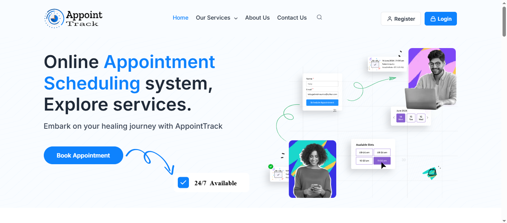

### 🩺 Healthcare Listing
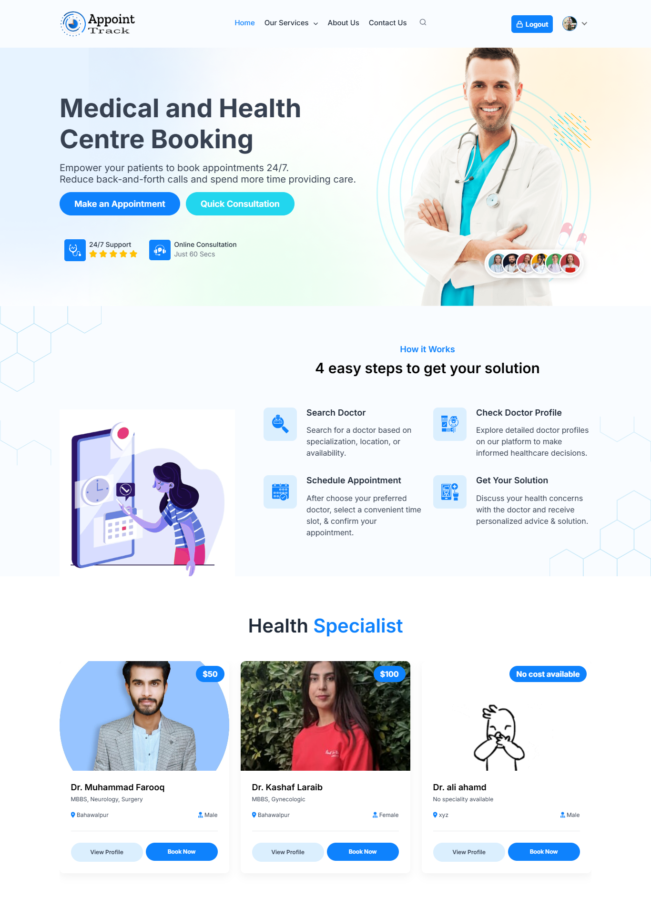

### 📅 Book Appointment
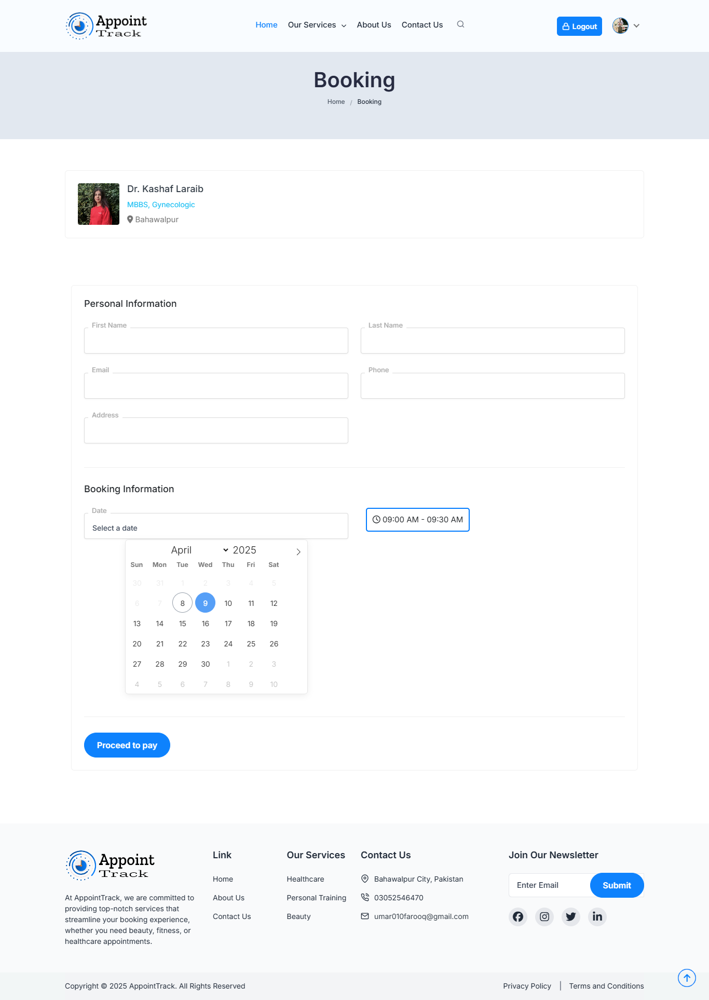

### 💳 Checkout & Payment
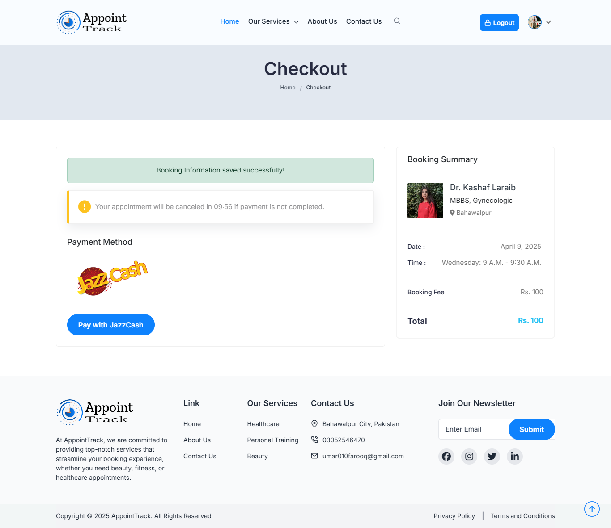
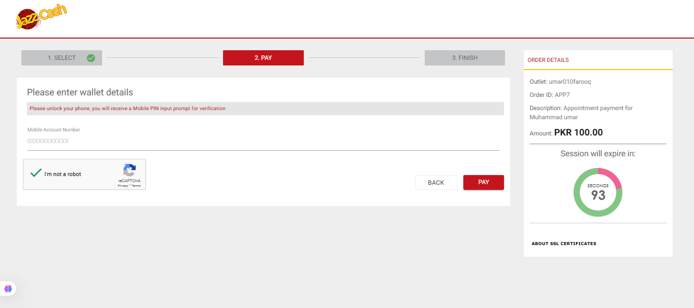

### ✅ User Appointments Dashboard
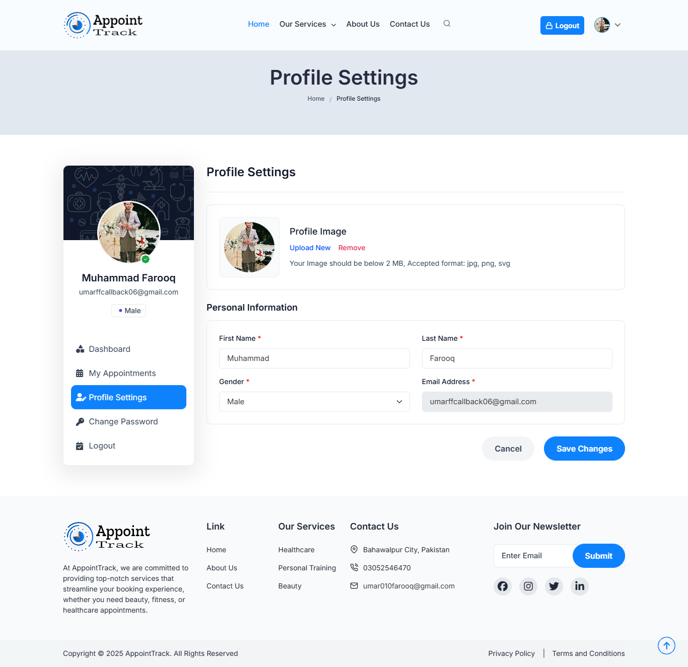

### 👨‍⚕️ Doctor Dashboard
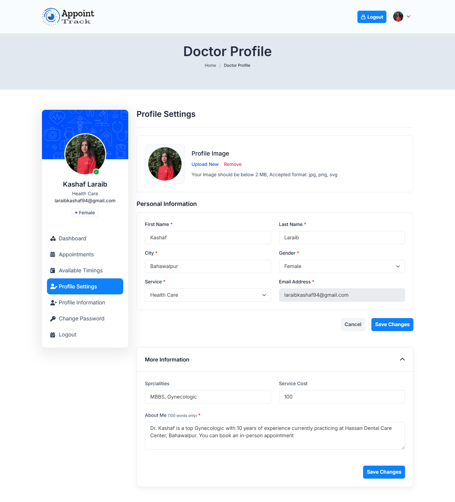

### 🗓️ Doctor Available Timings
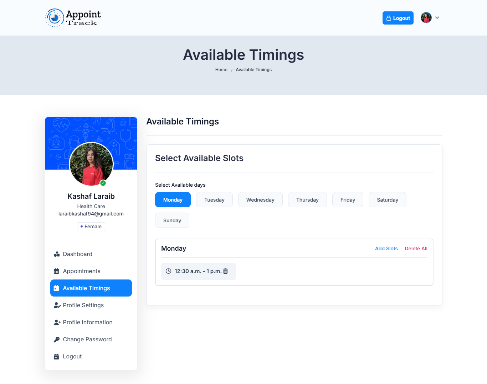

### 📋 Doctor Appointment Management
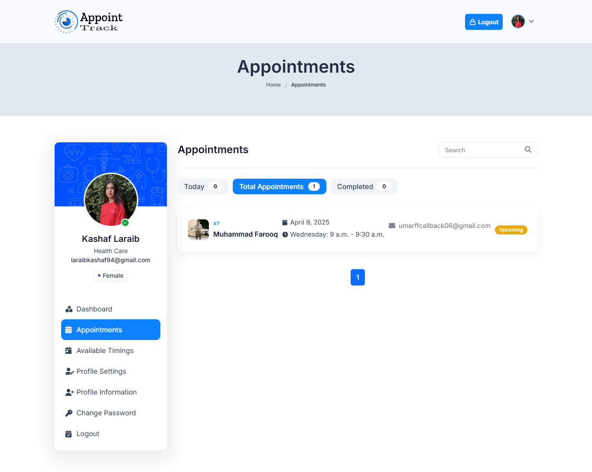

### 🔑 Login
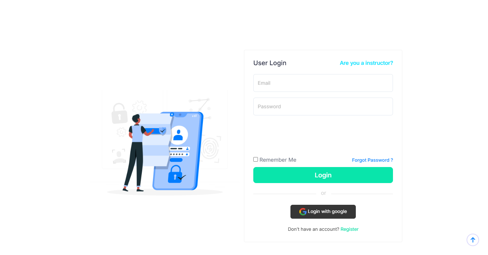

### 🔓 Register
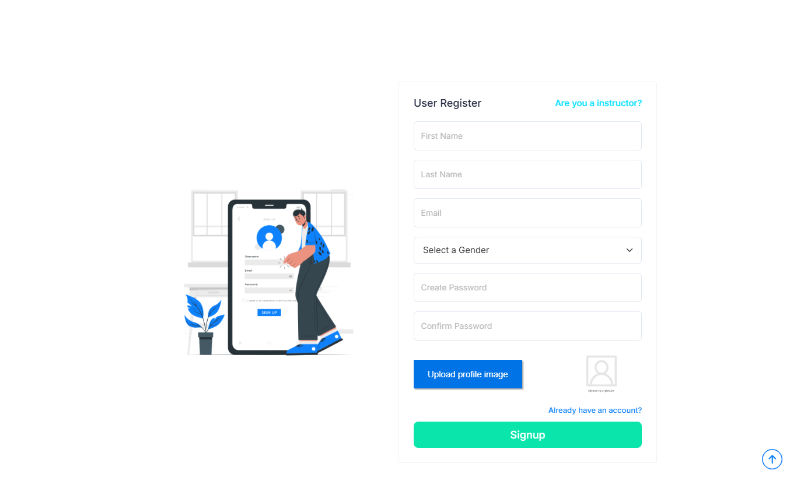
---

## ✨ Features

### 👤 Patient (User) Side
- ✅ User registration & login
- 🔐 Password reset via email
- 🌐 Google / Social authentication
- 🩺 Browse doctors by specialty (Healthcare, Beauty, Personal Trainer)
- 📅 Book appointments with available time slots
- 💳 JazzCash payment gateway integration
- 📊 Personal appointments dashboard
- ♻️ Cancel appointments
- 👤 Profile settings & password change

### 👨‍⚕️ Doctor (Instructor) Side
- 🔐 Separate instructor login & registration
- 📊 Instructor dashboard
- 🗓️ Manage available timings
- 📋 View & manage patient appointments
- ✅ Confirm / cancel appointments (live via WebSocket)
- 👤 Profile info & settings management

### ⚙️ Technical Features
- ⚡ Real-time booking status updates (Django Channels + WebSocket)
- 📧 Background email notifications (Celery + Redis)
- ⏰ Scheduled reminder tasks (Celery Beat)
- 🔔 Django Signals for automated triggers
- 🛡️ reCAPTCHA form protection
- 🌐 Social auth pipeline (Google login)
- 🎨 Bootstrap-based responsive UI

---

## ⚙️ Tech Stack

| Category | Technology |
|---|---|
| Backend | Django 5.0 |
| Real-time | Django Channels, WebSocket, Daphne (ASGI) |
| Background Tasks | Celery 5.4, Celery Beat |
| Message Broker | Redis |
| Database | SQLite (dev) / MySQL (prod) |
| Authentication | Django Auth, SimpleJWT, Social Auth (Google) |
| Payment | JazzCash Payment Gateway |
| Frontend | Bootstrap 5, HTML, CSS, JavaScript |
| Forms | Django Crispy Forms, reCAPTCHA |
| Email | Django Email + Celery async delivery |

---

## 🏗️ Project Structure
appointment-project/
│
├── appointBooking/       # Core booking logic
│   ├── consumers.py      # WebSocket consumers
│   ├── routing.py        # WebSocket URL routing
│   ├── signals.py        # Django signals
│   ├── tasks.py          # Celery background tasks
│   └── models.py         # Appointment models
│
├── authentication/       # Auth system
│   ├── backends.py       # Custom auth backends
│   └── pipeline.py       # Social auth pipeline
│
├── core/                 # Patient-facing views & templates
├── instructors/          # Doctor dashboard & management
├── appointment/          # Django config (settings, celery, asgi)
└── templates/            # HTML templates (Bootstrap)


---

## 🚀 Local Setup

### 1. Clone & Install

```bash
git clone https://github.com/UMAR010FAROOQ/appointment-project.git
cd appointment-project
pip install -r requirements.txt
```

### 2. Configure Environment

```bash
cp .env.example .env
# Edit .env with your DB, Redis, and email credentials
```

### 3. Run Migrations

```bash
python manage.py migrate
python manage.py createsuperuser
```

### 4. Start Redis (required for Celery + WebSocket)

```bash
redis-server
```

### 5. Start Celery Worker

```bash
celery -A appointment worker --loglevel=info
```

### 6. Start Celery Beat (scheduled tasks)

```bash
celery -A appointment beat --loglevel=info
```

### 7. Run Development Server

```bash
python manage.py runserver
```

---

## 🔄 How Real-time Updates Work
Doctor confirms appointment
↓
Django Signal fires
↓
WebSocket message sent via Django Channels
↓
Patient's browser receives live status update
↓
No page refresh needed ✅


---

## 📧 Background Task Flow
Appointment booked
↓
Celery task queued in Redis
↓
Email confirmation sent to patient (async)
↓
Celery Beat triggers reminder 24hrs before appointment


---

## 👥 User Roles

| Role | Access |
|---|---|
| **Patient** | Browse doctors, book, pay, manage appointments |
| **Doctor** | Manage availability, confirm/cancel appointments |
| **Admin** | Full Django admin access |

---

## 👨‍💻 Author

**Umar Farooq** — Backend Developer (Django / DRF)

[](https://linkedin.com/in/umar-farooq-developer)
[](https://github.com/UMAR010FAROOQ)
